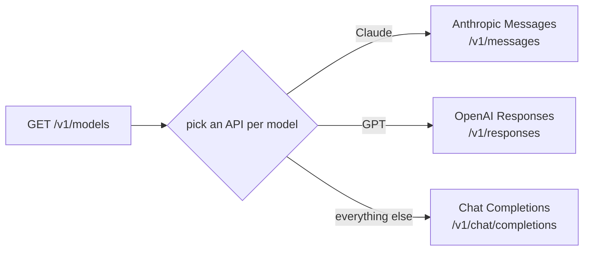

# @fullsend-ai/pi-inference-gateway

Any vendor-neutral **inference gateway** — [Praxis](docs/gateways/praxis.md), LiteLLM,
[agentgateway](docs/gateways/agentgateway.md), Bifrost, Portkey, an in-house proxy — as one
[pi](https://github.com/earendil-works/pi) provider. It asks the gateway which models it serves
(`GET /v1/models`), then sends **each model** over the protocol it needs, through pi's own
transports.



## Install

```bash
pi install git:github.com/fullsend-ai/pi-inference-gateway
```

## Quick start

Two environment variables are enough:

```bash
export INFERENCE_GATEWAY_BASE_URL=https://gateway.example.com   # with or without a trailing /v1
export INFERENCE_GATEWAY_API_KEY=...                             # your gateway key
```

No `pi login`: auth is ambient. Without a key or token file the gateway's models are registered but
not offered.

A pi extension that fails to load is dropped **silently**, so list the models first. Against the
mock gateway in this repo (see [Try it locally](CONTRIBUTING.md#try-it-locally)), with one extra
model added in the config file shown in [Config file](docs/configuration.md#config-file), pi 1.0.2:

```console
$ pi --list-models | grep -E '^(provider|gateway)'
provider  model                     context  max-out  thinking  images
gateway   claude-sonnet-5           1M       128K     yes       yes
gateway   gemini-3.5-flash          1.0M     65.5K    yes       yes
gateway   gpt-6-luna                272K     128K     yes       yes
gateway   oss/zai-org/glm-5-3       1M       131.1K   yes       no
```

That gateway lists only `claude-sonnet-5` and `gemini-3.5-flash`, both as `owned_by: "vertex"` with
no other metadata. The context windows and thinking support come from pi's own built-in catalog;
`gpt-6-luna` and `oss/zai-org/glm-5-3` come from the config file.

Then run a prompt:

```console
$ pi --no-session -p --model gateway/claude-sonnet-5 "say hi"
hi from /v1/messages as claude-sonnet-5
$ pi --no-session -p --model gateway/gemini-3.5-flash "say hi"
hi from /v1/chat/completions as gemini-3.5-flash
$ pi --no-session -p --model gateway/gpt-6-luna "say hi"
hi from /v1/responses as gpt-6-luna
```

(The mock answers with the path and model it saw, so you can tell which transport each model used.)

**Use the fully qualified `gateway/<model>` in scripts.** A bare `claude-sonnet-5` resolves to pi's
built-in `anthropic` provider, which wants its own key.

## Next steps

| Page | When you need it |
|---|---|
| [Configuration](docs/configuration.md) | Every environment variable, the config file (several gateways, per-model overrides), auth schemes, models the gateway does not list, gateway limits, session affinity, model-list refresh. |
| [Routing](docs/routing.md) | Which API each model is sent over, and which API to pick for a model family. |
| [Request features and thinking levels](docs/compat.md) | A gateway rejects a request field or a `reasoning_effort` value. |
| [Praxis](docs/gateways/praxis.md) | Your gateway is Praxis. |
| [agentgateway](docs/gateways/agentgateway.md) | Your gateway is agentgateway. |
| [Security](docs/security.md) | Where credentials are sent, and what is never read, followed or logged. |
| [Troubleshooting](docs/troubleshooting.md) | Something does not work; also the known limitations. |
| [Try it locally](CONTRIBUTING.md#try-it-locally) | Run the mock gateway in this repo instead of a real one. |

## Requirements

- pi ≥ 0.99.2 (CI runs 0.99.2 and 1.1.0 on every commit)
- A gateway exposing an OpenAI-style model list and at least one of `/v1/messages`,
  `/v1/responses`, `/v1/chat/completions`

No runtime dependencies.

---

Contributing, architecture, and the pi-specific gotchas behind the design:
[CONTRIBUTING.md](CONTRIBUTING.md). Rules for AI agents working in this repo: [AGENTS.md](AGENTS.md).

MIT licensed.
